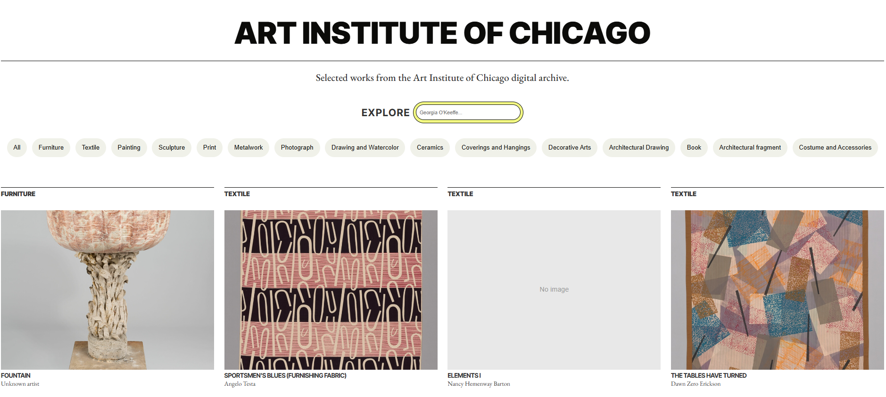

# Digital Archive — Art Institute of Chicago

> Browse and filter artworks from the [Art Institute of Chicago](https://www.artic.edu/) public API.



---

## Features

- Filter artworks by category
- Search by title or artist name (debounced 300 ms)
- Click any artwork to open a detail modal with medium, dimensions, artist info, style, and description
- Graceful image fallback when artwork images are unavailable

---

## Tech stack

- Vanilla TypeScript — compiled to JS, no framework, no bundler
- HTML / CSS
- [Art Institute of Chicago public API](https://api.artic.edu)

---

## Getting started

**1. Install dependencies**

```bash
npm install
```

**2. Compile TypeScript**

```bash
npm run build
```

To watch for changes during development:

```bash
npm run watch
```

**3. Open the app**

Serve the folder with any static server — opening `index.html` directly via `file://` may be blocked by some browsers:

```bash
npx serve .
```

Then open `http://localhost:3000` in your browser.

> No test runner, linter, or formatter is configured.

---

## Project structure

```
├── index.html        # Entry point — loads script.js as an ES module
├── script.ts         # All app logic (TypeScript source)
├── script.js         # Compiled output (generated by tsc, do not edit)
├── style.css         # Styles
├── site.webmanifest  # PWA manifest
├── tsconfig.json     # Strict TypeScript configuration
└── assets/           # Logo, favicons, screenshot
```

All app logic lives in a single file, `script.ts`, which compiles 1:1 to `script.js` and is loaded by `index.html` as `<script type="module">`.

---

## API

This app uses the [Art Institute of Chicago public API](https://api.artic.edu/docs/).

**Endpoint:**

```
GET https://api.artic.edu/api/v1/artworks
  ?fields=id,title,image_id,artist_title,artwork_type_title
  &limit=40
```

All filtering and search happen client-side — only this single request is made on load.

**Images** are served via [IIIF](https://iiif.io/):

```
https://www.artic.edu/iiif/2/{image_id}/full/843,/0/default.jpg
```

---

## Author

**Eugenia Demarchi**
